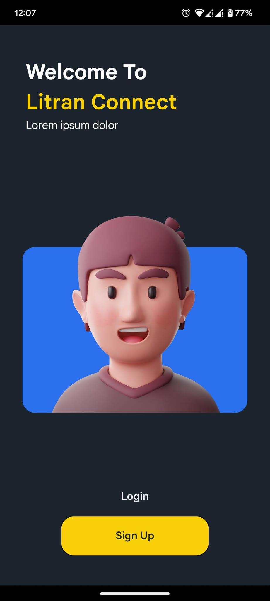
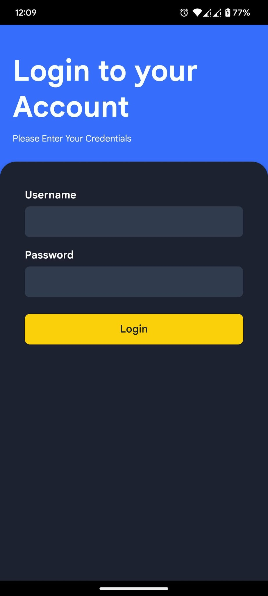
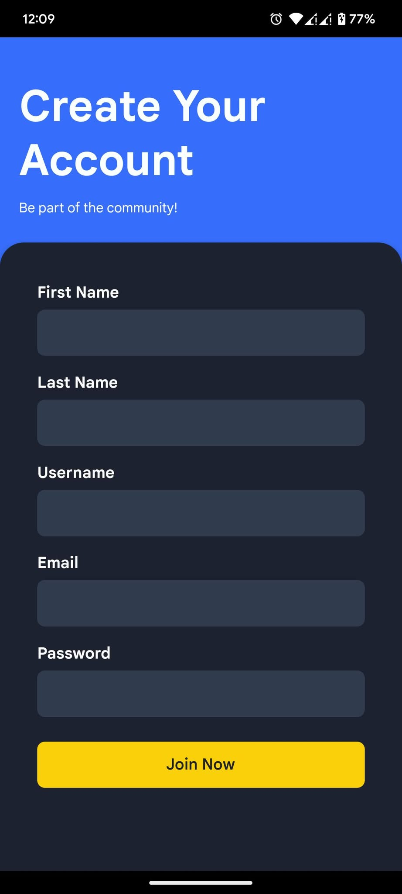

# React Native Login & Register UI

This is a new [**React Native**](https://reactnative.dev) project, bootstrapped using [`@react-native-community/cli`](https://github.com/react-native-community/cli).

## 📱 About the App

This is a **simple mobile UI** built with **React Native** featuring:

- ✨ A **Login** screen with email and password input fields.
- 📝 A **Registration** screen allowing users to create an account.
- ✅ Basic form validation and clean layout.
- 💅 Designed with minimal styling for easy customization and scalability.

---

## Getting Started

>**Note**: Make sure you have completed the [React Native - Environment Setup](https://reactnative.dev/docs/environment-setup) instructions till "Creating a new application" step, before proceeding.

...

## 🖼️ Screenshots

  
  
  

